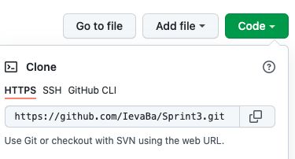

# Sprint 3 – Online Shop

- Sprint 3 is an Online Shop example I have done throughout my studies at BIT.
- Entire content was built for educational purposes and none of the items is available on the market.

## Description

- To finalise my project, I used Bootstrap framework v5.1.3.
- All commands were made using Git CLI.
- Project consists of two branches:
  - **main** – a basic version of the website and includes 4 pages;
  - **new_arrivals** – upgrated version with additional content and one more page.

## Launch procedure

Project was made using localy stored Bootstrap library. To open my project, follow the steps below:

1. Clone my Github repository [Sprint3](https://github.com/IevaBa/Sprint3.git). 
2. Open your terminal, type git clone, paste the URL you cloned and press Enter.
3. Bravo! You already have your local clone.
4. Now download Compiled CSS and JS Bootstrap library file. [Download](https://getbootstrap.com/docs/5.1/getting-started/download/)
5. Extract downloaded file.
6. Rename the library folder named "bootstrap-5.1.3-dist" to just “bootstrap” and store it in the "index.html" file directory.
7. Open "index.html" file using your preferred internet browser.
8. Enjoy 😊

## Author

This project was fully created by me - Ieva Baltriukaite.

Find me on [LinkedIn](https://www.linkedin.com/in/ieva-baltriukaite-59038755/)
